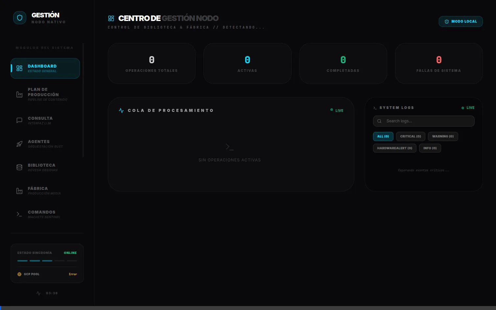
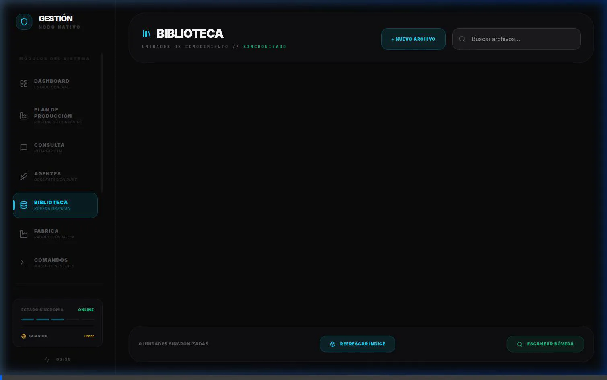

# ⚛️ Sentinel Media | Fenix Swarm
**Orquestación Neuronal, Ingeniería Defensiva y Generación Autónoma de Contenido**

*Sentinel Media no es un simple script de automatización. Es una infraestructura de conocimiento profundo (SSOT) orquestada en Rust, respaldada por matemáticas en Base-60 y memorias Ring-0 (eBPF), diseñada para sintetizar filosofía técnica, física avanzada y ciberseguridad en contenido de rigor profesional.*

> **Aviso para Contribuidores / IA**: Si buscas las reglas operativas de IA o Los 5 Axiomas Inmutables que rigen moral y tácticamente el proyecto, el mapa cognitivo se ha reubicado en `vault/_Agentes/ANTIGRAVITY_CONTEXT.md` como Prompt del Sistema maestro.

## 🖼️ Interfaz de Control (Sentinel Media GUI)

La interfaz de usuario es un centro de mando unificado construido con **Tauri v2**, **React** y **Framer Motion**, permitiendo la monitorización en tiempo real de todo el enjambre.


*Dashboard principal mostrando el estado del sistema, costos operativos y logs de telemetría.*

## 🏗️ Jerarquía de Verdad (SSOT)

La toma de decisiones del Cortex se basa en un flujo sagrado de ingesta:

1. **Ring 0 (eBPF)** — ACTIVO (modo monitor). Observabilidad del sistema a nivel Kernel.
2. **Memoria Neuronal (Rust)** — Núcleo nato de retención en `libs/me60os` (ResonantBuffer / CrystalLattice / mmap).
3. **RAG (La Bóveda)** — El clúster de conocimiento Markdown local bajo `vault/`.
4. **Bóveda Manager (Cortex)** — Orquestación autónoma que ensambla los nodos de memoria y dirige el comportamiento.

## 📡 Focos de Emisión (Canales Activos)

La *Factory* está diseñada para nutrir pilares de conocimiento técnico denso y sin diluir, rechazando de pleno enfoques genéricos:

- 🐧 **SecurePenguin ("El Ingeniero Soberano")** — Ciberseguridad Defensiva, eBPF y Hardening. Promulga la soberanía digital y el paso de C a Rust como victoria táctica del siglo.
- 🌀 **ZeroRing ("La Elegancia de las Leyes Naturales")** — Física Avanzada, entropía, cosmología teórica y sistemas ZPE.
- 🦀 **SentinelLabs ("Arquitectura de Sistemas")** — OS Internals, desarrollo profundo en Rust, optimización y mecánicas del Kernel.

## 🚀 Proyectos Rust Activos en la Fábrica

El sistema utiliza una arquitectura modular donde cada crate representa un agente o librería especializada. **NADA DE ESTO DEBE SER SIMPLIFICADO NI ELIMINADO**.

| Proyecto | Descripción | Estado Base |
|----------|-------------|--------|
| `core/` (sentinel_media_core) | Funciones compartidas (skill_loader, operation_store) | ✅ Compila |
| `cli/` (sentinel_media_cli) | CLI principal de orquestación y despachador | ✅ Compila |
| `research/` (sentinel_media_research)| Investigación y oráculo sintético (Gemini API) | ✅ Compila |
| `publisher/` (sentinel_media_publisher)| Generación y publicación telemetrizada de contenido | ✅ Compila |
| `memory/` (sentinel_media_memory) | Memoria vectorial con embeddings de Candle | ✅ Compila |
| `scanner/` (sentinel_media_scanner) | Escáner de sistema de archivos y bóveda | ✅ Compila |
| `verifier/` (sentinel_media_verifier)| Detección de alucinaciones y verificación de hechos | ✅ Compila |
| `system/` (sentinel_media_system) | Traductor SysAdmin de comandos | ✅ Compila |
| `media/` (sentinel_media_media) | Motor de renderizado (Veo 3.0 / procesamiento A/V) | ✅ Compila |
| `libs/me60os` | Sistema base-60 ME-60OS, matemática SPA/YATRA | ✅ Compila |
| `liquid_sim` | Simulador de sinapsis líquidas | ✅ Compila |
| `sentinel-vault-agent` | Agente principal en Rust | ✅ Compila |
| `sentinel-media-gui` | GUI Tauri (Rust + React) de monitoreo | ✅ Compila |

### 🏭 Operatividad de la Fábrica
El pipeline de producción automatizado permite escanear la bóveda, orquestar agentes de generación y supervisar el renderizado de activos en tiempo real.



### 📚 Gestión de la Bóveda y Editor
Sentinel Media incluye un editor de biblioteca integrado para manipular el conocimiento (SSOT) directamente, permitiendo a los agentes de IA analizar, traducir e ingestar documentos Markdown.



## 🔧 Compilación y Requisitos Técnicos

**Requisitos Previos del Sistema (Linux):**
Para poder compilar la interfaz gráfica de Tauri (sentinel-media-gui) sin errores:

```bash
sudo apt-get install -y libwebkit2gtk-4.1-dev build-essential curl wget file libssl-dev libayatana-appindicator3-dev librsvg2-dev
```

### Rutina de Compilación de Todos los Proyectos

Debido a que cada agente es su propio Crate altamente acoplado a la infraestructura central:

```bash
# Compilar cada motor individualmente en el Workspace
for project in core cli research publisher memory scanner verifier system media libs/me60os liquid_sim sentinel-vault-agent; do
    echo "Compilando $project..."
    cd $project && cargo check && cd ..
done

# Compilar GUI Tauri independientemente (requiere dependencias C/C++)
cd sentinel-media-gui/src-tauri && cargo check
```

## 🔄 CI/CD y Control de Integridad

- **tests.yml**: Ejecuta `cargo test` de manera granular por cada binario de agente y recolecta coverage.
- **rust-ci.yml**: Fuerza `cargo check` y `cargo clippy -- -D warnings` en entornos controlados frente a cada PR/push a `main` y `develop`.

---
*Propiedad Privada e Ingeniería de Jaime Novoa. Construido sobre Rust, Matemática Sexagesimal y el Método Científico. Todo intento de simplificación no autorizada de esta arquitectura está prohibida.*
